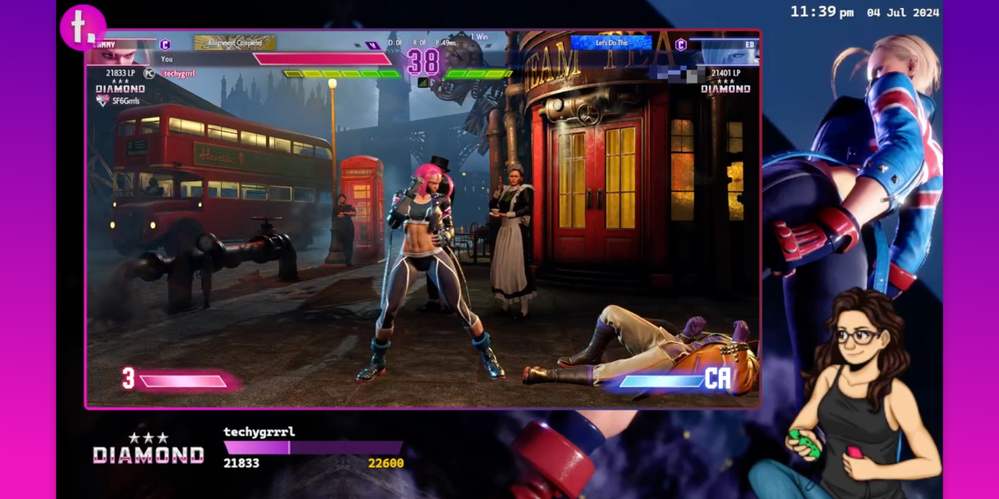

# sf6 rank watchrrr

A set of tools to provide Street Fighter 6 streamers with an overlay to watch their rank.

- [How it works](#how-it-works)
- [Usage](#usage)
  - [Server](#server)
  - [Client / Website / Overlay](#client--website--overlay)
  - [User script](#user-script)
- [Credits](#credits)

## How it works

There are 3 parts to this:

- Server that needs to be running locally. This is the source of truth for the data and communicates with both the overlay and the user script that gets the data from Buckler.
- User script that needs to be installed with your favourite script runner. This sends fresh data to the running server periodically (every 2 minutes but this can be configured). You need to be on the required page for the user script to run and send data to the server.
- Website/Overlay that is hosted, but you can also run this locally. This is the browser source that you load into OBS. It communicates with the server running on your computer.

## Usage

### Server

Run the server using the following command:

    npm start

This will run the server on port 55743.

### Client / Website / Overlay

You can configure the following:

| Key  | Type   | Description                                                                                                                     |
| ---- | ------ | ------------------------------------------------------------------------------------------------------------------------------- |
| host | string | URI-encoded IP address of the [server](#server) to connect to including port, e.g. `0.0.0.87:55743` would be `0.0.0.87%3A55743` |

You can use the hosted version of the client [here](https://sf6-rank-watchrrr.techygrrrl.stream/), or you can run the client locally by serving the `./client` directory by running the following command:

    npm run client

You may have to set your browser to allow unsafe content. To do this in Chrome, go into the Site settings, and set Insecure content to Allow.

### User script

Install the user script.

Once it's installed, login to the Buckler site and then visit this API URL: `https://www.streetfighter.com/6/buckler/api/en/card/YOUR_USER_ID` where `YOUR_USER_ID` is obviously your user ID. You can get this number from the address bar when visiting your own profile on Buckler. This is the URL for the current highest ranking Manon: `https://www.streetfighter.com/6/buckler/api/en/card/3708958378` where `3708958378` is this player's user ID.

You can configure the following:

| Key          | Type    | Description                                                                                                                       |
| ------------ | ------- | --------------------------------------------------------------------------------------------------------------------------------- |
| host         | string  | URI-encoded IP address of the [server](#server) to connect to including port, e.g. `10.0.0.87:55743` would be `10.0.0.87%3A55743` |
| refresh_time | integer | Refresh time in seconds. Minimum interval is 60.                                                                                  |

## Credits

- Images property of Capcom Co., Ltd.
- League Points data from [this spreadsheet](https://docs.google.com/spreadsheets/d/124KmfZzbTysS-qrZG5L-n2OXaepxdeHS4ipk3_043Rw/edit#gid=884923803)
